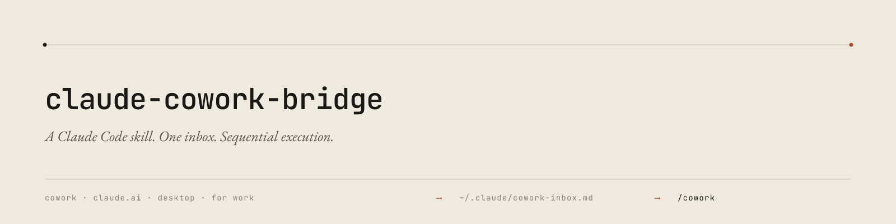

<p align="center">
  
</p>

# claude-cowork-bridge

A Claude Code skill that bridges any Claude conversation surface (Cowork, Claude.ai, Claude Desktop, Claude for Work) into Claude Code as actionable tasks. You audit, debug, or brainstorm in one Claude surface; the output flows into a global inbox; `/cowork` in Claude Code triages it, asks one confirmation, and burns through the batch sequentially with full project-rule honouring.

## The problem

Claude has many surfaces. Conversations on one of them (claude.ai, Cowork, Claude Desktop, Claude for Work) do not natively connect to Claude Code's filesystem-and-task layer. In practice this means handling findings one at a time, asking for a fix, then asking for the next, and so on. Slow, error-prone, impossible to batch, and easy to lose track of which findings have been actioned.

`claude-cowork-bridge` closes that gap with a thin, founder-owned glue layer. It is not an app. It is one Claude Code skill (`/cowork`) plus two configuration files in `~/.claude/`.

## How it works

1. Findings from your upstream Claude conversation arrive in `~/.claude/cowork-inbox.md`. The skill consumes the inbox; how the inbox gets populated is your choice — manual paste at the lightest, or any automation transport you set up (clipboard watcher, MCP tool, browser integration). The inbox is the contract.
2. In Claude Code, running `/cowork` reads the inbox, classifies findings (in-scope / cross-repo / out-of-scope / risk-flagged), shows one summary block, and asks for one reply.
3. On `go`, the skill runs every in-scope finding sequentially without per-step prompting. Risk-flagged findings (data-destructive operations) pause for explicit confirmation regardless.
4. Each completed finding moves to `~/.claude/cowork-archive/YYYY-MM-DD_<slug>.md`. Cross-repo findings leave follow-up notes for next-session pickup from another scope.
5. One aggregate report at the end — done count, skipped count, failed list, cross-repo follow-ups left, inbox state.

The skill is project-agnostic. It applies whatever rules your project's `CLAUDE.md` defines (data safety, schema discipline, branding, testing, cross-session coordination) by routing each finding through Claude Code's normal task flow. The only rule the skill enforces above and beyond your `CLAUDE.md` is a non-negotiable pause before any data-destructive operation.

## Install

### One-line install (Bash / Git Bash on Windows / macOS / Linux)

```bash
curl -L https://raw.githubusercontent.com/PlayQodeX/claude-cowork-bridge/main/install.sh | bash
```

### One-line install (PowerShell)

```powershell
irm https://raw.githubusercontent.com/PlayQodeX/claude-cowork-bridge/main/install.ps1 | iex
```

### Manual install

```bash
git clone https://github.com/PlayQodeX/claude-cowork-bridge.git
cd claude-cowork-bridge
./install.sh   # or .\install.ps1 on Windows PowerShell
```

The installer copies `skills/cowork/SKILL.md` into `~/.claude/skills/cowork/` and seeds `~/.claude/cowork-inbox.md` from the template if it does not already exist. Existing user files are never overwritten.

## Quick start

1. Open Claude Code in any project.
2. Land a finding (or several) in `~/.claude/cowork-inbox.md` — paste below the `---` for a manual first run, or wire up your transport of choice for steady-state.
3. Run `/cowork`. Reply `go` to the summary.
4. Walk away. Come back to the aggregate report.

## Optional configuration

By default the skill treats every finding as in-scope. To enable scope detection (so Claude can skip findings that target a different app and dispatch the right portion of cross-repo findings), create `~/.claude/cowork-config.json`:

```json
{
  "apps": ["app-one", "app-two", "shared-lib"],
  "projectRoots": ["/absolute/path/to/your/project-or-monorepo"]
}
```

See [docs/configuration.md](docs/configuration.md) for the full schema.

## Comparison with Claude's native dispatch

Claude's currently-shipped dispatch primitives are time-based or in-session: `/schedule` (cron-driven remote agents), `/loop` (interval-driven prompt re-runs), the Agent / Task tool (in-session sub-agents), and Anthropic Managed Agents via the SDK (programmatic dispatch). None of these natively connect a Claude conversation in one surface to a Claude Code session on the user's machine for execution. The dispatch surface in every native primitive is either Claude Code itself or a process Anthropic explicitly built a bridge for.

`claude-cowork-bridge` fills that cross-surface gap with founder-owned glue. The architecture is intentionally trivial to retire: a single skill-folder delete reverts to whichever native primitive eventually replaces it. Until then, the bridge is the lightest reasonable solution that captures the workflow.

## Documentation

- [Getting started](docs/getting-started.md) — first-run walkthrough.
- [Cowork-side setup](docs/cowork-side-setup.md) — configure your upstream conversation surface for clean dispatches.
- [Configuration](docs/configuration.md) — optional `cowork-config.json` schema and behaviour.
- [FAQ](docs/faq.md) — common questions.

## License

MIT — see [LICENSE](LICENSE).

## Contributing

See [CONTRIBUTING.md](CONTRIBUTING.md).
